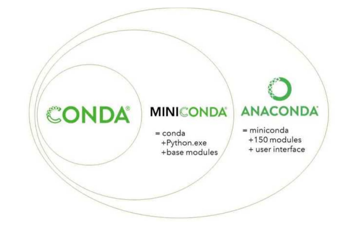

#Olx Bot

##Introduction
The basic purpose of this project to build a bot that automatically crawl [OLX](https://www.olx.com.pk). 

##Table of Content
* Anaconda/ Miniconda Installation 
* Virtual Environment
* Scrapy Framework
* Css and XPath Selectors
* Proxy Chains
* Selenium (optional)

#Prerequisites
It is recommended to create a virtual environment before installing dependencies for this project.

##Step 1 Anaconda / Miniconda Installation
Anaconda and miniconda are software distributions that are widely used in data science to simplify package management and deployment.



There are essentially two main differences:

* Number of packages: Anaconda comes with over 150 data science packages, whereas miniconda comes with only a handful.
* Interface: Anaconda has a graphical user interface (GUI) called the Navigator, while miniconda has a command-line interface.
* In other words, miniconda is a mini version of Anaconda. Miniconda ships with just the repository management system and a few packages. Whereas, with Anaconda, you have the distribution of some 150 built-in packages.

If you have not already installed Anaconda/Miniconda then you can download from [Official Site](https://www.anaconda.com/products/individual).

If you are new to conda then following are common commands

####conda installed version
```commandline
conda -V
```
####conda environments
```commandline
conda info --envs
```

####Check installed python versions
```commandline
conda search "^python$"
```

####Create virtual environment for scrapy project
```commandline
conda create -n environment_name_here python=3.8
```
If you want to use different python version then replace 3.8 with your own choice version.

####Activate virtual environment
```commandline
conda activate environment_name_here
```

####Install scrapy in activated environment
```commandline
conda install -n enviornment_name_here scrapy
```

####Deactivate virtual environment
```commandline
conda deactivate enviornment_name_here
```

####Remove virtual environment
```commandline
conda remove -n enviornment_name_here
```

##Run the Spider
```commandline
scrapy crawl OlxSpider -O olx-punjab-bicycles.json
```


#Credits
[Anaconda vs Miniconda](https://www.educative.io/edpresso/anaconda-vs-miniconda)